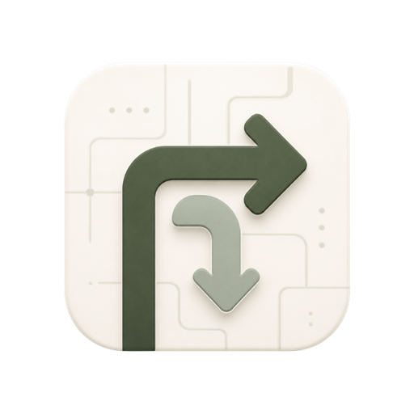
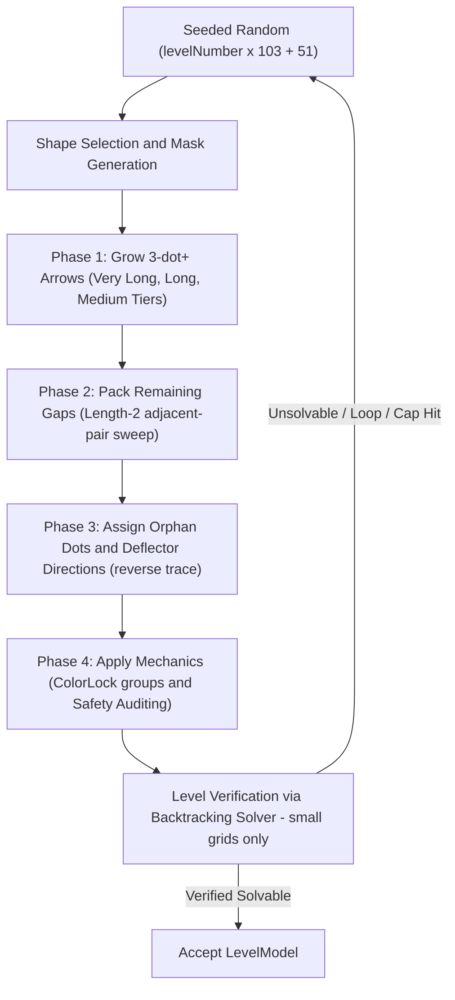

<div align="center">

  

# Arrow Escape

**A modern, casual grid puzzle game where you slide arrows out of the grid. Built with Flutter & Flame.**

  <p>
    <a href="https://github.com/gtxPrime/arrow-escape/stargazers">
      
    </a>
    <a href="https://github.com/gtxPrime/arrow-escape/network/members">
      
    </a>
    <a href="https://github.com/gtxPrime/arrow-escape/issues">
      
    </a>
    <a href="https://github.com/gtxPrime/arrow-escape/blob/main/LICENSE">
      
    </a>
    <a href="#">
      
    </a>
    <a href="https://github.com/gtxPrime/arrow-escape/releases/latest">
      
    </a>
  </p>

  <a href="https://github.com/gtxPrime/arrow-escape/releases/latest">
    
  </a>

  <h3>
    <a href="#about">About</a> <span>|</span>
    <a href="#features">Features</a> <span>|</span>
    <a href="#mechanics">Mechanics</a> <span>|</span>
    <a href="#stack">Stack</a> <span>|</span>
    <a href="#engine">Engine</a> <span>|</span>
    <a href="#structure">Structure</a> <span>|</span>
    <a href="#install">Install</a> <span>|</span>
    <a href="#monetization">Monetization</a>
  </h3>

</div>

---

<a id="about"></a>
## About Arrow Escape

> [!NOTE]
> **Arrow Escape** is a beautifully designed, highly interactive grid-based puzzle game. Players navigate challenges by sliding arrows out of the grid, encountering progressively harder difficulties — from Easy up to Legend. Built with the Flame game engine for Flutter, offering responsive animations, particle effects, and dynamic transitions across **500 pre-generated levels**.

---

<a id="features"></a>
## Core Features

### Engaging Gameplay

| Feature | Description |
|---|---|
| **Slide Mechanics** | Smooth grid movements with intuitive tap-to-slide controls |
| **500 Levels** | Tutorial (3 levels) through Easy, Medium, Hard, Expert, Master, Legend |
| **Deflector Dots** | Orphan cells that redirect an arrow exit path |
| **Color-Paired Arrows** | Matched-color arrows that must exit simultaneously |
| **Ice Arrows** | Two-tap mechanic: first tap cracks, second tap clears |
| **Long-Tap Preview** | Hold any arrow to see its full deflection path highlighted |
| **Dev Mode** | Long-press the game title (when enabled in code) to unlock all levels instantly |
| **Daily Streaks** | Consecutive-play tracking with milestone rewards |
| **Lives System** | 3 lives per level; animated hearts; lives lost counted toward star rating |
| **Timed Challenges** | God and Boss levels feature countdown timers scaling with arrow count |
| **Auto-Pause** | Observer-driven pause when app is backgrounded; timer suspends and resumes |
| **Pinch-to-Zoom** | Pinch the canvas to zoom in or out on large grids |
| **Deadlock Detection** | Detects when all remaining arrows are blocked; presents restart/inspect dialog |

### Visual & Sound

| Feature | Description |
|---|---|
| **Confetti & Particles** | Level-complete celebration with confetti burst and particle effects |
| **FPS Optimization** | Background dot grid cached as `ui.Picture`; 60/120 FPS maintained |
| **Soundtracks & SFX** | `flame_audio` for slide, crack, exit, win, lose audio states |
| **Nunito Typography** | Custom Nunito font family in weights 400/700/800/900 |
| **HSL Color Palette** | Sage-green earthy brand colors; separate dark and light palettes |
| **Smooth Animations** | `flutter_animate` micro-animations on every interactive element |

---

<a id="mechanics"></a>
## Game Mechanics & Elements

### The Grid

Arrow Escape uses a square grid canvas. The grid size (in cells) scales with the level number:

| Level Type | Grid Size Range |
|---|---|
| Tutorial (Levels 1-3) | Fixed 10 x 10 |
| Normal (Levels 4-19) | 15 x 15 to 24 x 24 |
| Normal (Levels 20-500) | 25 x 25 to 35 x 35 |
| Boss and God | 27 x 27 to 40 x 40 |

Only cells within the active **Mask Shape** are used.

---

### Level Types and Cadence

After the 3 tutorial levels, the game follows a repeating **7-level cycle**:

```
Position:  1    2    3   [4]   5    6   [7]
Type:     Norm Norm Norm BOSS Norm Norm  GOD
```

- **Normal** — Standard puzzle on a square grid
- **Boss** — Shaped silhouette grid (animal/object shape), optional countdown timer
- **God** — Dramatic geometric silhouette grid, countdown timer always active

---

### Difficulty Bands

| Level Range | Difficulty |
|---|---|
| 1 - 10 | Tutorial |
| 11 - 30 | Easy |
| 31 - 70 | Medium |
| 71 - 150 | Hard |
| 151 - 300 | Expert |
| 301 - 500 | Master |
| 500+ | Legend |

---

### Arrow Elements

Every arrow is an `ArrowModel` with the following properties:

| Field | Type | Description |
|---|---|---|
| `id` | String | Unique identifier e.g. "a_12_3" |
| `row`, `col` | int | Head cell coordinates |
| `direction` | ArrowDirection | up / down / left / right — the exit direction |
| `path` | List of [row,col] | Ordered cells from head (index 0) to tail (last) |
| `state` | ArrowState | idle / sliding / blocked / exited / cracked / locked |
| `mechanic` | SnakeMechanic | standard / colorLock / iceSegment |
| `colorGroup` | int or null | Non-null groups two arrows into a color pair |

#### Arrow Directions

| Enum | Delta [dRow, dCol] | Rotation |
|---|---|---|
| up | [-1, 0] | -pi/2 radians |
| down | [+1, 0] | +pi/2 radians |
| left | [0, -1] | pi radians |
| right | [0, +1] | 0 radians |

The base rendered asset points right (0 rad). `ArrowComponent` rotates the canvas by `direction.rotationRadians` before drawing.

#### Arrow States

| State | Meaning |
|---|---|
| idle | Waiting for the player tap |
| sliding | Exit animation in progress |
| blocked | Path obstructed — shake animation plays, life is lost |
| exited | Successfully left the grid; removed from model list |
| cracked | Ice arrow first tap done — needs one more tap |
| locked | Color-lock arrow whose partner has not exited yet |

#### Arrow Mechanics

| Mechanic | Behaviour |
|---|---|
| standard | Tap — if path clear, arrow slides and exits; otherwise blocked |
| colorLock | Two arrows share a colorGroup. Tap either — both paths checked simultaneously. Both clear = both exit. Either blocked = both shake, one life lost |
| iceSegment | First tap (path clear) = cracked state. Second tap = exits. First tap while blocked = shake + life lost |

---

### Orphan Dots (Deflector Dots)

An orphan dot is an isolated grid cell that could not be covered by any arrow during generation. It acts as a redirect deflector for exiting arrows.

#### Orphan Dot Types

| OrphanDotType | Appearance | Effect on Exiting Arrow |
|---|---|---|
| neutral | Grey dot | Arrow passes straight through unchanged |
| up | Gold dot, up icon | Redirects arrow to travel upward |
| down | Gold dot, down icon | Redirects arrow to travel downward |
| left | Gold dot, left icon | Redirects arrow to travel left |
| right | Gold dot, right icon | Redirects arrow to travel right |

> [!NOTE]
> When an arrow traverses an orphan dot, the dot is **consumed** and disappears from the grid permanently for that session. Each dot can only deflect one arrow.

#### Orphan Dot Turn Helpers in Code

```dart
// 90 degrees clockwise (used by red deflector visuals)
ArrowDirection get turnRight { ... }

// 90 degrees counter-clockwise (used by blue deflector visuals)
ArrowDirection get turnLeft { ... }
```

#### Tutorial Level 3 — Deflector Introduction

Level 3 places one orphan dot at cell [4, 4] of type `right`. Arrow `a_3_1` at [6, 4] pointing up would normally exit straight up — but the deflector at [4, 4] redirects it rightward, so it exits the right edge instead.

---

### Exit Path Computation

The core path-validity logic lives in `GameState._computeExitInfo()`:

```
1. Start from the arrow head cell, one step in direction d
2. While inside the grid bounds:
   a. If current cell is an orphan dot
         -> record as "consumed", change d to dot direction
   b. If current cell is occupied by another arrow body
         -> return blocked = true
   c. If current cell was already visited
         -> infinite loop detected -> return blocked = true
3. Stepped out of grid -> return blocked = false (success)
```

Formally, a board state S = (A, D) is solvable if there exists a valid slide sequence pi:

$$\pi = (a_1, a_2, \dots, a_N) \in \text{Permutations}(A) \quad \text{s.t.} \quad \forall i,\; a_i \xrightarrow{\text{slide}} \text{Exit}(G, D_{i-1})$$

where D_{i-1} is the remaining deflector state after a_1 ... a_{i-1} have been removed.

---

### Lives System

- Each player has **3 lives** per level (configurable via `AppConstants.maxLives`).
- A life is lost whenever: an arrow tap is blocked (hits a wall or another arrow), or a color-pair group is blocked.
- **Dev Mode** bypasses all life deduction — wrong taps show the shake animation but lives are never decremented.
- Star rating: **0 lives lost = 3 stars**, **1 life lost = 2 stars**, **2+ lives lost = 1 star**.

```
Score = baseScore(100) + lives_remaining x bonusPerRemainingLife(50)
```

Special bonuses:
- Boss level completion: +200 points
- God level completion: +500 points

---

### Timer System (Boss and God Levels)

Boss and God levels feature a countdown timer. Duration dynamically scales with the number of arrows and level difficulty. If time runs out, a timeout dialog offers a rewarded-ad second chance.

- Resuming via rewarded ad grants bonus time proportional to remaining arrow count.
- When the app is backgrounded, the timer **auto-pauses** via `didChangeAppLifecycleState` and resumes on foreground.

---

### Dev Mode

Dev Mode is a developer/testing feature that unlocks all 500 levels instantly and disables life loss on wrong taps.

#### Enabling / Disabling Dev Mode at the Code Level

In `lib/core/constants.dart`:

```dart
// true  -> long-press gesture on the title is ACTIVE (dev/test builds)
// false -> Dev Mode is completely DISABLED (production builds)
static const bool enableDevMode = true;
```

> [!CAUTION]
> **Always set `enableDevMode = false` before publishing a production build.** Leaving it `true` allows any player to unlock all 500 levels for free by long-pressing the title.

#### Activating Dev Mode at Runtime

When `AppConstants.enableDevMode == true`:

1. Open the **Main Menu**.
2. **Long-press** the "Arrow Escape" title text.
3. A golden **DEV MODE** badge appears below the title.
4. A snackbar confirms: "Dev Mode Enabled: All levels unlocked!"
5. Long-press again to toggle it off.

Dev Mode state persists across restarts via `SharedPreferences` (key: `isDevMode`).

---

### Mask Shapes

Boss and God levels use shaped silhouettes instead of a plain square grid:

| Category | Shapes |
|---|---|
| Standard | square, circle |
| Geometric (God levels) | heart, star, diamond, hexagon, blob |
| Animals (Boss levels) | cat, dog, frog, fox, tiger, panda, fish, bird, butterfly |
| Objects (Boss levels) | guitar, tree, house, crown, saturn |

Shapes are generated by `MaskGenerator` and stored as a `Set<String>` of active "row,col" keys.

---

### Long-Tap Preview

Long-pressing any arrow projects a glowing path overlay showing:
- The arrow exit direction
- Each orphan dot the path passes through
- The redirected path after each deflection
- Whether the final path exits the grid (green glow) or hits an obstacle (red glow)

---

<a id="stack"></a>
## Tech Stack

| Layer | Technology | Version |
|---|---|---|
| Framework | Flutter | SDK >=3.0.0 <4.0.0 |
| Game Engine | Flame Engine | ^1.18.0 |
| Audio | Flame Audio | ^2.10.0 |
| State Management | Provider | ^6.1.2 |
| Animations | Flutter Animate | ^4.5.0 |
| Confetti | Confetti | ^0.7.0 |
| Local Storage | Shared Preferences | ^2.3.2 |
| Typography | Google Fonts | ^6.2.1 |
| Icons | Lucide Icons Flutter | ^3.1.14+2 |
| Ads (Google) | Google Mobile Ads | ^5.1.0 |
| Ads (Unity) | Unity Ads Plugin | ^0.4.0 |

---

<a id="engine"></a>
## Game Engine & Level Generation

The game uses the **Flame Engine** — a modular Flutter game engine — for rendering ticks, touch gesture detection, particle simulation, and canvas compositing.

### Game Loop & Engine Flow

Flame drives a dual-phase tick:

1. **`update(double dt)`** — Evaluates animations (slide offsets, rotation angles, particle decay), updates `GameState`, fires state-machine transitions.
2. **`render(Canvas canvas)`** — Draws grid cells, deflector plates, arrows, and particle bursts onto the double-buffered canvas. Static components are pre-rasterised into a `ui.Picture` buffer to maintain **60 / 120 FPS**.

---

### Level Generation Pipeline (v4 Rewrite)

Every level is fully generated programmatically and deterministically from its level number:



#### Seeded Randomness

```dart
final seed = levelNumber * 103 + 51;
final rng = Random(seed);
```

Produces **identical layouts for a given level ID** on all devices and platforms.

---

### Grid Size Formulas

**Normal levels** (l = level number):

$$\text{gridSize} = \begin{cases} 15 + \text{round}\!\left(\frac{(l-4)\times 9}{15}\right) & \text{if } l < 20,\text{ clamped to }[15,24] \\ 25 + \text{round}\!\left(\frac{(l-20)\times 10}{480}\right) & \text{if } l \ge 20,\text{ clamped to }[25,35] \end{cases}$$

**Boss / God levels** (k = cycle count for that type):

$$\text{gridSize} = 27 + \text{round}\!\left(\frac{(k-1)\times 13}{19}\right), \quad \text{clamped to } [27,40]$$

---

### 3-Phase Fill Pipeline

#### Phase 1 — Three-dot-and-longer Arrows

Places arrows in a **33% Very Long / 33% Long / 34% Medium** target ratio. Tier thresholds are grid-size adaptive:

$$\text{veryLongMin} = 5 + \left\lfloor \frac{G}{6} \right\rfloor$$

$$\text{longMin} = 3 + \left\lfloor \frac{G}{10} \right\rfloor$$

Phase 1 ends when no candidate start position has enough free neighbours for any arrow of length 3 or more.

#### Phase 2 — 2-dot Pair-Sweep

Fills remaining gaps with exit-constrained length-2 arrows, then a greedy adjacent-pair sweep. **No arrows of length 3 or more are placed in Phase 2.**

#### Phase 3 — Orphan Dots and Deflector Assignment

Uncovered cells become orphan dots. Deflection direction is computed by reverse-tracing candidate exit paths to find a direction that allows future arrows to exit the grid edge.

---

### Tangle Factor

Controls how much very-long arrows zig-zag versus travel straight:

| Level Range | Base Tangle | Max Straight Run |
|---|---|---|
| Tutorial | 0.0 | n/a |
| 4 - 14 | 0.0 | 3 cells |
| 15 - 30 | 0.10 | 3 cells |
| 31 - 60 | 0.30 | 3 cells |
| 61 - 150 | 0.60 | 2-3 cells |
| 151 - 300 | 0.80 | 2 cells |
| 300+ | 1.0 | 2 cells |

Boss levels: tangle factor +0.15. God levels: tangle factor +0.25 (min 0.40).

$$\text{turnBias} = 0.65 + \text{tangleFactor} \times 0.20$$

$$\text{maxStraight} = \begin{cases} 2 & \text{if tangleFactor} \ge 0.7 \\ 3 & \text{otherwise} \end{cases}$$

---

### Deflector Density (Orphan Bounds)

Maximum allowed orphan dots $E_{\text{max}}$ as a clamped percentage of mask area $M$:

$$E_{\text{max}} = \text{clamp}\!\Big(5,\;\lceil M \times P \rceil,\;150\Big)$$

Density coefficient $P$ depends on grid size $G$:

$$P = \begin{cases} 22\% & G \le 20 \\ 16\% & G > 20 \end{cases}$$

---

### ColorLock Pair Safety

Color-paired arrows share a `colorGroup` integer. The safety audit verifies:

1. The two arrows exit paths do not cross each other body cells (mutual-blocking prevention).
2. Both paths can be simultaneously clear — checked using `_computeExitInfo(arrow1, ignoreId: arrow2.id)` so each ignores the other body.

---

### Safety Audits

| Audit | What It Checks |
|---|---|
| Orphan Loop Safety | No deflector configuration creates an infinite circular redirection loop |
| ColorLock Pair Safety | Paired arrows exit paths do not pass through each other body cells |
| Solver DFS | For small grids (20 cells or fewer): full depth-first search with dynamic state cap. Unsolvable levels are fully discarded and re-generated |

---

### Level Data Asset (assets/levels.bin)

Boss and God levels use grids up to 40 x 40 with hundreds of arrows. On-device generation causes multi-second freezes. All **500 levels** are pre-generated offline and shipped as a single compact binary (**887 KB**).

```
[HEADER]       8 bytes     magic 'LVLB' + version + level count
[INDEX TABLE]  N x 4 bytes byte offset of each level record
[DATA]         per level: gridSize, maskShape, difficulty, patternName,
               arrows (direction / mechanic / path as delta steps),
               mask bitmask, orphan dots
```

Encoding optimisations:
- Bitmask grid masks: 113 bytes per 30x30 grid vs thousands of coordinate strings
- Delta-encoded arrow paths: 1 byte per step vs full [row, col] pairs
- Index table: O(1) seek to any level, no file scanning required

`LevelRepository` loads only the 8-byte header at startup and seeks directly to the requested level.

---

### Arrow Component Rendering

`ArrowComponent` draws each arrow with:
- **Curved arrowhead** on the head cell (path index 0)
- **Segment separators** between consecutive path cells
- **Flat tail** on the tail cell (last path index)
- **Slide offset** computed from current animation progress
- **Rotation** applied via `direction.rotationRadians` before canvas draw calls

---

<a id="structure"></a>
## Project Structure

```
lib/
├── ads/
│   └── ad_manager.dart              # AdMob / Unity Ads orchestrator and priority waterfall
├── core/
│   ├── app_colors.dart              # HSL color palette, light and dark theme tokens
│   ├── audio_manager.dart           # Singleton audio controller (music + SFX)
│   └── constants.dart               # AppConstants: grid sizes, enableDevMode, scoring, ad IDs
├── data/
│   ├── level_binary_codec.dart      # Binary encoder/decoder for levels.bin
│   ├── level_generator/
│   │   ├── level_generator.dart     # v4 generator: 3-phase pipeline, tangle, ColorLock
│   │   ├── mask_generator.dart      # All mask shapes (cat, star, heart, guitar ...)
│   │   ├── pattern_library.dart     # Pattern name catalogue
│   │   └── solver.dart              # DFS backtracking solver for solvability verification
│   ├── models/
│   │   ├── arrow.dart               # ArrowModel, ArrowDirection, SnakeMechanic, ArrowState
│   │   └── level.dart               # LevelModel, OrphanDot, MaskShape, Difficulty, LevelResult
│   └── repositories/
│       ├── level_repository.dart    # Level cache, async generation, binary asset loading
│       └── progress_repository.dart # Lives, score, streak, dev mode, SharedPreferences
├── game/
│   ├── arrow_puzzle_game.dart       # Main Flame Game controller (mounts all components)
│   ├── components/
│   │   ├── arrow_component.dart     # Flame component: renders and animates each arrow
│   │   ├── grid_component.dart      # Flame component: grid background, orphan dots, overlay
│   │   └── particle_effect.dart     # Particle burst effects on arrow exit
│   └── game_state.dart              # In-game state machine: lives, tap handler, deadlock
├── screens/
│   ├── game/
│   │   └── game_screen.dart         # Main gameplay screen, timer, tutorial dialogs, overlays
│   ├── game_over/                   # Game Over, retry, rewarded-ad continue dialogs
│   ├── level_select/                # Level selector with stars, lock states, type badges
│   ├── main_menu/                   # Main menu, dev mode gesture, streak, settings nav
│   ├── settings/                    # Sound, music, vibration, theme toggles
│   └── splash/                      # Splash / loading screen
├── widgets/
│   ├── arrow_line.dart              # Decorative arrow path widget (used in tutorial UI)
│   ├── lives_bar.dart               # Animated heart lives bar widget
│   ├── unified_banner_ad.dart       # Unified AdMob/Unity banner ad widget
│   └── wavy_progress_bar.dart       # Animated timer progress bar
├── app.dart                         # MaterialApp root, routing, theme switching
└── main.dart                        # Entry: init audio, ads, SharedPrefs, providers

assets/
├── audio/
│   ├── underwater.mp3               # Background game music loop
│   ├── click.ogg                    # UI button click SFX
│   └── swoosh_18.mp3                # Arrow slide / exit SFX
├── fonts/
│   ├── Nunito-Regular.ttf
│   ├── Nunito-Bold.ttf
│   ├── Nunito-ExtraBold.ttf
│   └── Nunito-Black.ttf
├── images/
│   └── logo.png                     # App launcher icon and in-game logo
└── levels.bin                       # Pre-generated binary level data (887 KB, 500 levels)
```

---

<a id="install"></a>
## Installation

### Prerequisites

- **Flutter SDK** >= 3.0.0 — [Install Flutter](https://docs.flutter.dev/get-started/install)
- Dart is bundled with Flutter (no separate install needed)
- Run `flutter doctor` to verify your environment

---

### Windows — Run & Build

> [!IMPORTANT]
> Windows desktop support requires `flutter config --enable-windows-desktop` run once.

```powershell
git clone https://github.com/gtxPrime/arrow-escape.git
cd arrow-escape
flutter config --enable-windows-desktop
flutter pub get
flutter run -d windows

# Release build
flutter build windows --release
# Output: build\windows\x64\runner\Release\arrow_escape.exe
```

> [!NOTE]
> The game was designed for mobile portrait mode and runs in a fixed window on desktop.

---

### Web — Run & Build

> [!IMPORTANT]
> Requires `flutter config --enable-web` once. Set `enableAdMob = false` and `enableUnityAds = false` before building — ad SDKs are not supported on web.

```bash
flutter config --enable-web
flutter pub get
flutter run -d chrome

# Release build
flutter build web --release
# Output: build/web/ — deploy to any static host
```

---

### Android APK — Quick Install

```bash
git clone https://github.com/gtxPrime/arrow-escape.git
cd arrow-escape
flutter pub get

# Run on connected device / emulator
flutter run

# Release APK
flutter build apk --release
# Output: build/app/outputs/flutter-apk/app-release.apk

# Install on connected device
adb install build/app/outputs/flutter-apk/app-release.apk

# Smaller split APKs (recommended for sharing)
flutter build apk --split-per-abi --release
```

> [!TIP]
> Use `--split-per-abi` for smaller files. Install the `arm64-v8a` build on modern Android phones.

---

### Android Studio — Full Setup

1. **Install Android Studio** — [Download](https://developer.android.com/studio)
2. **Install plugins:** File → Settings → Plugins → search **Flutter** → Install → Restart
3. **Open project:** File → Open → select `arrow-escape/` folder
4. **Wait for Gradle sync** to complete
5. **Create AVD:** Tools → Device Manager → Create Device → Pixel 6 + API 33 → Start
6. **Select device** in the toolbar dropdown
7. **Run:** Green Run button or `Shift+F10`
8. **Build APK:** Terminal tab → `flutter build apk --release`

> [!NOTE]
> If "Flutter SDK not found": File → Settings → Languages & Frameworks → Flutter → set SDK path (e.g. `C:\flutter`).

---

### iOS — Run & Build (macOS required)

> [!IMPORTANT]
> Building for iOS **requires a Mac** with Xcode. iOS builds cannot be produced on Windows or Linux.

```bash
# Install Xcode from Mac App Store (v14+)
xcode-select --install
sudo gem install cocoapods

git clone https://github.com/gtxPrime/arrow-escape.git
cd arrow-escape
flutter pub get
cd ios && pod install && cd ..

# Run on iPhone or iOS Simulator
flutter run

# Open in Xcode for signing setup
open ios/Runner.xcworkspace
# Signing & Capabilities -> select your Apple Developer Team

# Release build
flutter build ios --release
# Archive & distribute: Product -> Archive -> Distribute App
```

> [!TIP]
> For free Apple Developer account: select your Apple ID team in Xcode, then trust the certificate on device at Settings → General → VPN & Device Management.

---

### Build Targets Summary

| Platform | Command | Output |
|---|---|---|
| Android APK | `flutter build apk --release` | `build/app/outputs/flutter-apk/app-release.apk` |
| Android App Bundle | `flutter build appbundle --release` | `build/app/outputs/bundle/release/app-release.aab` |
| iOS | `flutter build ios --release` | `build/ios/iphoneos/Runner.app` |
| Web | `flutter build web --release` | `build/web/` |
| Windows | `flutter build windows --release` | `build/windows/x64/runner/Release/` |
| macOS | `flutter build macos --release` | `build/macos/Build/Products/Release/` |
| Linux | `flutter build linux --release` | `build/linux/x64/release/bundle/` |

---

<a id="monetization"></a>
## Monetization & Configuration

Arrow Escape has an integrated ad system with a priority waterfall: **Google AdMob (Priority 1) → Unity Ads (Priority 2)**. AppLovin SDK integration is fully deprecated.

### Feature Toggles

All toggles live in `lib/core/constants.dart`:

| Constant | Default | Description |
|---|---|---|
| `enableDevMode` | `true` | Enables the long-press dev mode gesture on the main menu title |
| `enableAdMob` | `false` | Set to `true` to activate Google AdMob ads |
| `enableUnityAds` | `false` | Set to `true` to activate Unity Ads |
| `enableAppLovin` | `false` | Deprecated — keep `false` |

### Google AdMob Setup

```dart
static const String admobAppIdAndroid       = 'ca-app-pub-XXXXXXXXXX~XXXXXXXXXX';
static const String admobBannerUnitId       = 'ca-app-pub-XXXXXXXXXX/XXXXXXXXXX';
static const String admobInterstitialUnitId = 'ca-app-pub-XXXXXXXXXX/XXXXXXXXXX';
static const String admobRewardedUnitId     = 'ca-app-pub-XXXXXXXXXX/XXXXXXXXXX';
```

Also update `android/app/src/main/AndroidManifest.xml`:

```xml
<meta-data
  android:name="com.google.android.gms.ads.APPLICATION_ID"
  android:value="ca-app-pub-XXXXXXXXXX~XXXXXXXXXX"/>
```

### Unity Ads Setup

```dart
static const String unityGameId           = 'YOUR_UNITY_GAME_ID';
static const String unityBannerAdId       = 'Banner_Android';
static const String unityInterstitialAdId = 'Interstitial_Android';
static const String unityRewardedAdId     = 'Rewarded_Android';
static const bool   unityTestMode         = false;
```

### Interstitial Frequency

```dart
static const int interstitialEveryNLevels = 4;
```

---

## Customization Guide

### 1. Change the App Package Name

- Update `applicationId` and `namespace` in `android/app/build.gradle.kts`
- Update package in `android/app/src/main/AndroidManifest.xml`
- Rename folder structure under `android/app/src/main/kotlin/`
- Or use: `dart run change_app_package_name:main com.yourcompany.yourapp`

### 2. Logo & Launch Screen

- Replace icons in `android/app/src/main/res/mipmap-*/ic_launcher.png`
- Replace main logo at `assets/images/logo.png`
- Edit splash background in `android/app/src/main/res/drawable/launch_background.xml`

### 3. Audio & Music

| File | Purpose |
|---|---|
| `assets/audio/underwater.mp3` | Background music loop |
| `assets/audio/click.ogg` | UI click SFX |
| `assets/audio/swoosh_18.mp3` | Arrow slide / exit SFX |

### 4. Difficulty Balancing

```dart
static const int bossLevelEvery = 3; // every 3rd post-tutorial level is Boss
static const int godLevelEvery  = 5; // every 5th is God (overrides Boss)
```

7-level cycle: `[Normal, Normal, Normal, Boss, Normal, Normal, God]`

---

### Re-use & Giving Credit

This project is open-source under the MIT License. If you copy, fork, or use substantial portions of the code, assets, levels, or mechanics, **you must give explicit credit** by linking to:

**https://github.com/gtxPrime/arrow-escape**

---

## Star History

[](https://star-history.com/#gtxPrime/arrow-escape&Date)
