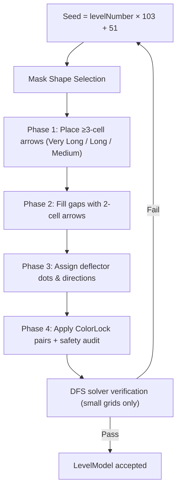

<div align="center">


# Arrow Escape

**A casual grid puzzle game — slide arrows out of the grid. Built with Flutter & Flame.**

  <p>
    <a href="https://github.com/gtxPrime/arrow-escape/stargazers">
      
    </a>
    <a href="https://github.com/gtxPrime/arrow-escape/network/members">
      
    </a>
    <a href="https://github.com/gtxPrime/arrow-escape/issues">
      
    </a>
    <a href="https://github.com/gtxPrime/arrow-escape/blob/main/LICENSE">
      
    </a>
    <a href="#">
      
    </a>
    <a href="https://github.com/gtxPrime/arrow-escape/releases/latest">
      
    </a>
  </p>

  <a href="https://github.com/gtxPrime/arrow-escape/releases/latest">
    
  </a>

</div>

---

## About

Arrow Escape is a grid-based puzzle game where players slide arrows out of the grid. Each level is procedurally generated and deterministic — the same level number always produces the same puzzle on every device. The game ships with **500 pre-generated levels** across 7 difficulty tiers, with tutorial, Boss, and God level variants.

---

## Features

| Feature | Description |
|---|---|
| **Slide Mechanics** | Tap an arrow — if its path to the edge is clear, it exits |
| **500 Levels** | Tutorial → Easy → Medium → Hard → Expert → Master → Legend |
| **Deflector Dots** | Gold dots that redirect an arrow's exit direction |
| **Color-Paired Arrows** | Two arrows of matching color must exit simultaneously |
| **Long-Tap Preview** | Hold an arrow to preview its full exit path |
| **Lives System** | 3 lives per level; star rating based on lives remaining |
| **Timed Challenges** | Boss and God levels have countdown timers |
| **Dev Mode** | Unlock all levels instantly (disabled in production via `enableDevMode`) |
| **Daily Streaks** | Consecutive-play rewards |
| **Pinch-to-Zoom** | Zoom in/out on large grids |
| **Deadlock Detection** | Detects unsolvable states and offers restart |
| **Dark / Light Mode** | Sage-green earthy palette with full theme support |

---

## Tech Stack

| Layer | Technology | Version |
|---|---|---|
| Framework | Flutter | SDK >=3.0.0 <4.0.0 |
| Game Engine | Flame | ^1.18.0 |
| Audio | Flame Audio | ^2.10.0 |
| State | Provider | ^6.1.2 |
| Animations | Flutter Animate | ^4.5.0 |
| Storage | Shared Preferences | ^2.3.2 |
| Fonts | Google Fonts (Nunito) | ^6.2.1 |
| Ads | Google Mobile Ads + Unity Ads | ^5.1.0 / ^0.4.0 |

---

## Game Mechanics

### Grid & Level Types

The grid is a square canvas — size scales with level number:

| Level Range | Grid Size |
|---|---|
| Tutorial (1-3) | 10 x 10 |
| Normal (4-19) | 15 x 15 to 24 x 24 |
| Normal (20-500) | 25 x 25 to 35 x 35 |
| Boss & God | 27 x 27 to 40 x 40 |

After the 3 tutorial levels, every 7 levels follow this cycle:

```
Position:  1    2    3   [4]   5    6   [7]
Type:     Norm Norm Norm BOSS Norm Norm  GOD
```

- **Normal** — Standard square grid puzzle
- **Boss** — Shaped silhouette grid (animal/object shape), optional timer
- **God** — Geometric silhouette grid, countdown timer always on

### Difficulty Bands

| Level Range | Difficulty |
|---|---|
| 1 - 10 | Tutorial |
| 11 - 30 | Easy |
| 31 - 70 | Medium |
| 71 - 150 | Hard |
| 151 - 300 | Expert |
| 301 - 500 | Master |
| 500+ | Legend |

### Arrow Mechanics

- **standard** — Tap an arrow: path clear = exits, path blocked = shake + life lost
- **colorLock** — Two matched-color arrows must exit simultaneously; either blocked = both shake + life lost
- **Deflector Dots** — Gold dots redirect an exiting arrow and are consumed on use

### Lives & Scoring

- 3 lives per level. A life is lost on every blocked tap or blocked color-pair.
- Dev Mode bypasses life loss (shakes still play).
- Star rating: 0 lost = 3★, 1 lost = 2★, 2+ lost = 1★

```
Score = 100 + lives_remaining × 50
Boss bonus: +200 pts   |   God bonus: +500 pts
```

### Dev Mode

```dart
// lib/core/constants.dart
static const bool enableDevMode = true;
```

> [!CAUTION]
> Set `enableDevMode = false` before any production release. When `true`, long-pressing the main menu title unlocks all 500 levels instantly.

**To activate at runtime:** Long-press "Arrow Escape" on the main menu. Long-press again to disable. State persists via SharedPreferences.

---

## Level Generation

Every level is generated deterministically from its level number:



### Key Formulas

**Grid size — Normal levels** (l = level number):

$$\text{gridSize} = \begin{cases} 15 + \text{round}\!\left(\frac{(l-4)\times 9}{15}\right) & l < 20,\; [15,24] \\ 25 + \text{round}\!\left(\frac{(l-20)\times 10}{480}\right) & l \ge 20,\; [25,35] \end{cases}$$

**Grid size — Boss/God** (k = cycle count):

$$\text{gridSize} = 27 + \text{round}\!\left(\frac{(k-1)\times 13}{19}\right), \quad [27,40]$$

**Arrow length tiers** (G = grid size):

$$\text{veryLongMin} = 5 + \left\lfloor G/6 \right\rfloor \qquad \text{longMin} = 3 + \left\lfloor G/10 \right\rfloor$$

**Tangle factor** (controls zig-zag vs straight):

| Level Range | Base Tangle | Boss boost | God boost |
|---|---|---|---|
| 4 - 14 | 0.0 | +0.15 | +0.25 |
| 15 - 60 | 0.10 - 0.30 | +0.15 | +0.25 |
| 61 - 300 | 0.60 - 0.80 | +0.15 | +0.25 |
| 300+ | 1.0 | — | — |

$$\text{turnBias} = 0.65 + \text{tangleFactor} \times 0.20$$

**Max deflector dots** (M = active mask cells):

$$E_{\text{max}} = \text{clamp}\!\left(5,\;\lceil M \times P \rceil,\;150\right) \quad P = 22\% \text{ if } G \le 20, \text{ else } 16\%$$

### Level Binary Asset (`assets/levels.bin`)

All 500 levels are pre-generated and shipped as a single **887 KB** binary to avoid on-device generation lag on large grids.

```
[HEADER]      8 bytes      magic 'LVLB' + version + level count
[INDEX]       N × 4 bytes  byte offset per level (O(1) seek)
[DATA]        gridSize, maskShape, arrows (delta-encoded paths),
              mask bitmask, deflector dots
```

### Mask Shapes

Boss/God levels use shaped silhouettes:

| Category | Shapes |
|---|---|
| Geometric | heart, star, diamond, hexagon, blob, circle |
| Animals | cat, dog, frog, fox, tiger, panda, fish, bird, butterfly |
| Objects | guitar, tree, house, crown, saturn |

---

## Installation

### Prerequisites

- Flutter SDK >= 3.0.0 — [flutter.dev/get-started](https://docs.flutter.dev/get-started/install)
- Run `flutter doctor` to verify setup

### Android APK

```bash
flutter pub get
flutter build apk --release
# Output: build/app/outputs/flutter-apk/app-release.apk

# Smaller split APKs (install arm64-v8a on modern phones)
flutter build apk --split-per-abi --release
```

### Android Studio

1. Install Android Studio + Flutter & Dart plugins
2. **File → Open** → select the project folder
3. Wait for Gradle sync, create an AVD, press **Run**

### iOS (macOS only)

```bash
sudo gem install cocoapods
flutter pub get
cd ios && pod install && cd ..
flutter run
open ios/Runner.xcworkspace   # set signing team, then build
flutter build ios --release
```

### Web

```bash
flutter config --enable-web
flutter pub get
flutter run -d chrome
flutter build web --release   # deploy build/web/ to any static host
```

> [!IMPORTANT]
> Disable ads before web builds: `enableAdMob = false`, `enableUnityAds = false` in `constants.dart`.

### Windows

```bash
flutter config --enable-windows-desktop
flutter pub get
flutter run -d windows
flutter build windows --release
# Output: build\windows\x64\runner\Release\arrow_escape.exe
```

### All Platforms

| Platform | Build Command | Output |
|---|---|---|
| Android APK | `flutter build apk --release` | `build/app/outputs/flutter-apk/app-release.apk` |
| Android AAB | `flutter build appbundle --release` | `build/app/outputs/bundle/release/app-release.aab` |
| iOS | `flutter build ios --release` | `build/ios/iphoneos/Runner.app` |
| Web | `flutter build web --release` | `build/web/` |
| Windows | `flutter build windows --release` | `build/windows/x64/runner/Release/` |

---

## Monetization

Ad priority waterfall: **AdMob → Unity Ads**. All off by default.

### Toggles (`lib/core/constants.dart`)

| Constant | Default | Purpose |
|---|---|---|
| `enableDevMode` | `true` | Long-press dev mode gesture (disable in production) |
| `enableAdMob` | `false` | Google AdMob |
| `enableUnityAds` | `false` | Unity Ads |

### AdMob

```dart
static const String admobAppIdAndroid       = 'ca-app-pub-XXXXXXXXXX~XXXXXXXXXX';
static const String admobBannerUnitId       = 'ca-app-pub-XXXXXXXXXX/XXXXXXXXXX';
static const String admobInterstitialUnitId = 'ca-app-pub-XXXXXXXXXX/XXXXXXXXXX';
static const String admobRewardedUnitId     = 'ca-app-pub-XXXXXXXXXX/XXXXXXXXXX';
```

Add to `android/app/src/main/AndroidManifest.xml`:
```xml
<meta-data android:name="com.google.android.gms.ads.APPLICATION_ID"
           android:value="ca-app-pub-XXXXXXXXXX~XXXXXXXXXX"/>
```

### Unity Ads

```dart
static const String unityGameId           = 'YOUR_UNITY_GAME_ID';
static const String unityRewardedAdId     = 'Rewarded_Android';
static const bool   unityTestMode         = false;
```

### Interstitial Frequency

```dart
static const int interstitialEveryNLevels = 4;
```

---

> This project is MIT licensed. If you fork or reuse significant portions, please give credit by linking back to this repository.

---

## Star History

<div align="center">
  <a href="https://star-history.com/#gtxPrime/arrow-escape&Date">
    
  </a>
</div>
