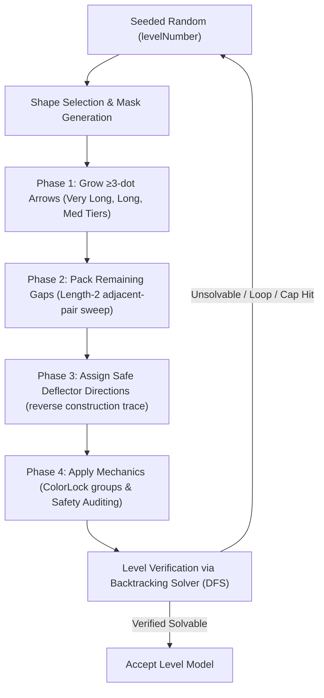

<div align="center">

  

# Arrow Escape

**A modern, casual grid puzzle game where you slide arrows out of the grid. Built with Flutter & Flame.**

  <p>
    <a href="https://github.com/gtxPrime/arrow-escape/stargazers">
      
    </a>
    <a href="https://github.com/gtxPrime/arrow-escape/network/members">
      
    </a>
    <a href="https://github.com/gtxPrime/arrow-escape/issues">
      
    </a>
    <a href="https://github.com/gtxPrime/arrow-escape/blob/main/LICENSE">
      
    </a>
    <a href="#">
      
    </a>
    <a href="https://github.com/gtxPrime/arrow-escape/releases/latest">
      
    </a>
  </p>

  <a href="https://github.com/gtxPrime/arrow-escape/releases/latest">
    
  </a>

  <h3>
    <a href="#-features">Features</a>
    <span> | </span>
    <a href="#-tech-stack">Tech Stack</a>
    <span> | </span>
    <a href="#-game-engine">Game Engine</a>
    <span> | </span>
    <a href="#-project-structure">Project Structure</a>
    <span> | </span>
    <a href="#-installation">Installation</a>
    <span> | </span>
    <a href="#-monetization">Monetization</a>
  </h3>

</div>

---

##  About Arrow Escape

> [!NOTE]
> **Arrow Escape** is a beautifully designed, highly interactive grid-based puzzle game. Players navigate challenges by sliding arrows out of the grid, encountering progressively harder difficulties (from Easy up to Boss & Super Hard levels). Developed using the powerful Flame game engine for Flutter, it offers responsive animations, particle effects, and dynamic transitions.

---

## <a id="-features"></a> Core Features

###  Engaging Gameplay
* ✦ **Slide Mechanics:** Smooth grid movements with intuitive touch controls.
* ✦ **Progressive Difficulty:** Levels ranging from simple tutorial-like grids to mind-bending Boss and Super Hard configurations (up to 500 levels).
* ✦ **Deflector Dots (Orphan Dots):** Isolated cells remaining after generation are converted to deflectors. 
  * Starting levels ($\le 20$) feature neutral (grey) dots that arrows pass straight through.
  * Higher levels introduce red (clockwise/right) and blue (counter-clockwise/left) deflector dots.
* ✦ **Long Tap Arrow Preview:** Long-pressing any arrow projects a glowing deflection path on hold, mapping out redirect dots and obstacles.
* ✦ **Dev Mode:** Unlock all levels instantly with a long press on the main menu title (indicated by a golden DEV MODE badge).
* ✦ **Daily Streaks:** Tracks user gameplay consistency and records daily play sessions.
* ✦ **Lives System:** Keep track of remaining lives with custom visual meters and animated, synchronized heart icons.
* ✦ **Timed Challenges:** God levels (after level 100) and Boss levels (after level 200) feature dynamic countdown timers. The duration scales with the difficulty and quantity of arrows. Resuming from a timeout via rewarded ads grants a dynamic extra time buffer matching the quantity of remaining arrows, coupled with an observer-driven auto-pause system for background/foreground transitions.

###  Visual & Sound Effects
* ✦ **Juicy Animations:** Utilizes `flutter_animate`, Confetti, and custom Lottie integrations for satisfying level-complete feedback.
* ✦ **Performance Optimized (FPS Fix):** Heavy background layers (e.g. background dot grid) are cached as a static `ui.Picture` to avoid expensive redraw commands on every Frame tick. Reduced confetti emissions prevent frame drops on mid-to-lower range devices.
* ✦ **Soundtracks & SFX:** Rich audio feedback powered by `flame_audio` and `audioplayers` for sliding, matching, winning, and losing states.
* ✦ **Premium UI:** Designed with HSL-tailored colors, smooth gradients, and custom Nunito typography.

---

## <a id="-tech-stack"></a> Tech Stack

- **Framework:** [Flutter](https://flutter.dev/) (SDK `>=3.0.0 <4.0.0`)
- **Game Engine:** [Flame Engine](https://flame-engine.org/) & [Flame Audio](https://github.com/flame-engine/flame/tree/main/packages/flame_audio)
- **State Management:** [Provider](https://pub.dev/packages/provider)
- **Animations:** [Flutter Animate](https://pub.dev/packages/flutter_animate), [Lottie](https://pub.dev/packages/lottie), [Confetti](https://pub.dev/packages/confetti)
- **Local Storage:** [Shared Preferences](https://pub.dev/packages/shared_preferences)
- **Typography & Icons:** [Google Fonts](https://pub.dev/packages/google_fonts), [Lucide Icons](https://pub.dev/packages/lucide_icons_flutter)

## <a id="-game-engine"></a> Game Engine & Level Generation

The game leverages the **Flame Engine** (a modular Flutter game engine library) to manage high-frequency rendering ticks, touch gestures, physics simulation, and particles.

###  Game Loop & Engine Flow
The game loop runs on a dual-phase execution tick:
1. **Update Phase (`update(double dt)`)**: Evaluates real-time animations (e.g. arrow slide offsets, rotation angles, particle decay times) and updates the logical coordinate grid in `GameState`.
2. **Render Phase (`render(Canvas canvas)`)**: Draws grid cells, deflector plates, standard arrows, and particle effects directly onto the double-buffered screen canvas. Under the hood, static components are recached into an isolate `ui.Picture` buffer to keep CPU/GPU draw cycles at a constant 60/120 FPS.

###  The Level Generation Pipeline (v4 Rewrite)
Every level is fully generated programmatically and deterministically from a level number seed:



- **Seeded Randomness**: Uses `Random(levelNumber * 103 + 51)` to produce identical layouts for a given level ID across all player devices.
- **3-Phase Fill Pipeline**:
  - **Phase 1 (≥3-dot Arrows)**: Places longer paths (33% Very Long [$\ge \text{ceil}(\text{gridSize} \times 0.55)$], 33% Long [$\ge \text{ceil}(\text{gridSize} \times 0.40)$], and 34% Medium [3–5 cells]). Terminates when no candidate positions can accept paths $\ge 3$.
  - **Phase 2 (2-dot Pair-Sweep)**: Fills remaining gaps using exit-constrained length-2 arrows first, then falls back to a greedy adjacent-pair sweep to maximize cell coverage.
  - **Phase 3 (Orphans & Deflector Assignment)**: Any remaining un-fillable single cells are designated as **Orphan Dots**. If a level allows direction dots (e.g. boss/god or tutorial 3), orphan cells are set as deflectors with directions computed by reverse-tracing candidate exit paths.
- **Aesthetic Path Growth Constraints**:
  - **Tangle Factor**: Higher levels use adaptive turn biases (up to 85% turn-chance) and shorter max-straight limits (down to 2 cells) to yield visually tangled, organic zig-zag bodies.
  - **Anti-Square Check**: The path growth algorithm actively rejects moves that form closed loops (where an arrow body loops back to enclose its own starting region).
- **Safety Audits**:
  - **Orphan Dot Loop Safety**: Checks that redirect deflector settings do not create infinite redirection loops or locking redirect boxes.
  - **ColorLock Pair Safety**: Verifies that paired arrows do not cross each other's bodies, preventing mutually-blocking configurations.
- **Solver Backtracking DFS Verification**: A custom depth-first search solver parses the generated board. The layout is accepted only if it solves within a dynamic state cap.

###  Level Data Asset (`assets/levels.bin`)

Boss and God levels use large 40×40 grids with hundreds of arrows — generating them on-device causes freezes. All 500 levels are pre-generated on PC and shipped as a single compact binary file (`assets/levels.bin`, **887 KB**).

The binary format uses:
- **Bitmask grid masks** — 113 bytes per 30×30 grid instead of hundreds of coordinate strings
- **Delta-encoded arrow paths** — 1 byte per step instead of full `[row, col]` pairs
- **Index table** — O(1) seek to any level by number, no scanning

```
[HEADER]       8 bytes   magic 'LVLB' + version + level count
[INDEX TABLE]  N × 4 bytes  byte offset of each level record
[DATA]         per level: gridSize, maskShape, difficulty, patternName,
               arrows (direction/mechanic/path as delta steps),
               mask bitmask, orphan dots
```

`LevelRepository` loads only the header on startup and seeks directly to whichever level is needed — the rest of the file is untouched.


###  Arrow Definition & Components
Arrows are modeled in `ArrowModel` and rendered by `ArrowComponent`:
- **Logical Model (`ArrowModel`)**: Defines the ID, head cell coordinate `(row, col)`, exit direction `ArrowDirection` (up, down, left, right), coordinate segment list (`path`), state (idle, sliding, blocked, exited), and color-locked grouping ID.
- **Visual Component (`ArrowComponent`)**: Standard arrows are drawn with a curved head, distinct segment separators, and a flat tail. They automatically compute slide offsets and orientation rotations dynamically during slide transitions.

###  Algorithmic Mechanics

The generator models the puzzle constraints mathematically to guarantee solvable and challenging states:

#### 1. Dynamic Grid Scaling
The board dimensions grow dynamically as a function of the level number:
* Normal levels ramp from 15x15 (level 4) to 35x35 (level 500).
* Boss/God levels scale up to 40x40 at high cycles.

#### 2. Deflector Density (Orphan Bounds)
The target quantity of deflector dots is computed as a percentage of the total active mask area ($M$) and is capped:
$$E_{\text{max}} = \text{clamp}\Big(5, \,\, \lceil M \times P \rceil, \,\, 150\Big)$$
where the density coefficient $P$ scales based on grid dimensions:
$$P = \begin{cases} 16\% & \text{if } G > 20 \\ 22\% & \text{if } G \le 20 \end{cases}$$

#### 3. Arrow Type Distributions
The arrow lengths follow a discrete target ratio among standard paths ($\text{Length} \ge 3$):
- **Medium Arrows** ($3 \le \text{Length} \le 5$): $\approx 65\%$
- **Long Arrows** ($\text{Length} \ge 6$): $\approx 35\%$

#### 4. Solvability Constraints
A board state $S = (A, D)$ is solvable if there exists a valid slide sequence $\pi$:
$$\pi = (a_1, a_2, \dots, a_N) \in \text{Permutations}(A) \quad \text{s.t.} \quad \forall i, \,\, a_i \xrightarrow{\text{slide}} \text{Exit}(G, D_{i-1})$$
where $D_{i-1}$ represents the remaining deflector dot configurations on the grid after removing $a_1 \dots a_{i-1}$.

---

## <a id="-project-structure"></a> Project Structure

```
lib/
├── core/                      # App constants, theme colors, helper functions
├── data/
│   ├── level_binary_codec.dart  # Binary encoder/decoder for levels.bin
│   ├── models/                # Game models (Level, Arrow, OrphanDot, etc.)
│   ├── level_generator/       # Procedural generator, solver, mask shapes
│   └── repositories/          # Level access (binary asset) & user progress
├── game/
│   ├── components/            # Flame Components (Grid, Arrows, Particles)
│   ├── arrow_puzzle_game.dart # Main Flame Game Controller
│   └── game_state.dart        # In-game state machine and progression handlers
├── screens/
│   ├── game_over/             # Game Over and retry logic
│   ├── main_menu/             # Main Menu, level selector, daily streak UI
│   └── play_screen/           # Main gameplay viewport wrapping the Flame widget
└── widgets/                   # Reusable UI controls (LivesBar, ActionButton…)

assets/
└── levels.bin                 # Pre-generated binary level data (887 KB, 500 levels)
```

---

## <a id="-installation"></a> Installation

Follow these instructions to run the game locally:

### 1. Prerequisites
- Install the [Flutter SDK](https://docs.flutter.dev/get-started/install) (Ensure it is in your system `PATH`).
- Run `flutter doctor` to verify correct environment setup.

### 2. Setup Codebase
Clone this repository and fetch the dependencies:
```bash
git clone https://github.com/gtxPrime/arrow-escape.git
cd arrow-escape
flutter pub get
```

### 3. Run the Game
Ensure you have an active emulator or real device connected:
```bash
flutter run
```

### 4. Build Executables
* **Android APK:**
  ```bash
  flutter build apk --release
  ```
* **Android App Bundle (for Play Store publishing):**
  ```bash
  flutter build appbundle --release
  ```

---

## <a id="-monetization"></a> Monetization & Configuration

The game features an integrated ad system: **Google AdMob (Priority 1) -> Unity Ads (Priority 2)**. AppLovin SDK integration has been fully deprecated.

### Feature Toggles
You can dynamically toggle any of the integrated ad networks on/off using the following constants in `AppConstants`:
- `enableAdMob` (default: `false`): Set to `true` to active Google AdMob ads.
- `enableUnityAds` (default: `false`): Set to `true` to active Unity Ads.

### Ad Unit Configuration
Update the corresponding unit and app identifiers in `lib/core/constants.dart` for your production ad units:

#### 1. AppLovin MAX Setup
- `applovinSdkKey`: Your unique AppLovin SDK key.
- `applovinBannerAdId`: AppLovin Banner Ad Unit ID.
- `applovinInterstitialAdId`: AppLovin Interstitial Ad Unit ID.
- `applovinRewardedAdId`: AppLovin Rewarded Ad Unit ID.
*Note: Make sure to add your AppLovin SDK key in your `<meta-data>` inside your `AndroidManifest.xml` if compiling for Android.*

#### 2. Google AdMob Setup
- `admobAppIdAndroid`: Google AdMob App ID.
- `admobBannerUnitId`: AdMob Banner Ad Unit ID.
- `admobInterstitialUnitId`: AdMob Interstitial Ad Unit ID.
- `admobRewardedUnitId`: AdMob Rewarded Ad Unit ID.
*Note: Also update the `<meta-data>` tag in [AndroidManifest.xml](file:///f:/Source%20Codes/Arrow%20game/android/app/src/main/AndroidManifest.xml) with your live AdMob App ID.*

#### 3. Unity Ads Setup
- `unityGameId`: Your Unity Game ID.
- `unityBannerAdId`: Unity Banner Placement ID (default: `'Banner_Android'`).
- `unityInterstitialAdId`: Unity Interstitial Placement ID (default: `'Interstitial_Android'`).
- `unityRewardedAdId`: Unity Rewarded Placement ID (default: `'Rewarded_Android'`).
- `unityTestMode`: Set to `false` for live production ads.

---

## 🎨 Customization Guide

If you wish to customize and build your own version of Arrow Escape, follow these instructions:

### 1. Change the App Package Name
To publish your own version on the Google Play Store or iOS App Store, you need to change the application package name (Application ID):
- **Android:**
  - Update `applicationId` and `namespace` in `android/app/build.gradle.kts`.
  - Update the package name in `android/app/src/main/AndroidManifest.xml`.
  - Rename the package folder structure under `android/app/src/main/kotlin/` to match your new package name.
  - Or, use a package like [change_app_package_name](https://pub.dev/packages/change_app_package_name) to do this automatically.

### 2. Customizing Logo & Launch Screen
- **App/Launcher Logo:** 
  - Replace the launcher icons under `android/app/src/main/res/mipmap-*` folders with your own `ic_launcher.png` images.
  - Replace the main application logo at [logo.png](assets/images/logo.png).
- **Launch Screen Background:**
  - The launch/splash background drawable layer is defined in [launch_background.xml](android/app/src/main/res/drawable/launch_background.xml). It uses `@android:color/transparent` by default. You can change this to any color drawable or custom resource.

### 3. Modifying Audio & Music Files
Sound effects and background tracks are located in the [assets/audio/](assets/audio/) directory:
- `underwater.mp3`: Background game music.
- `click.ogg` / `swoosh_18.mp3`: Sound effects for user interactions.
- Simply replace these files with your own audio assets keeping the same file names, or add new tracks and update references in `lib/game/arrow_puzzle_game.dart` / `lib/core/constants.dart`.

### ⚠️ Re-use & Giving Credit
This project is open-source. If you decide to copy, fork, or use substantial portions of the source code, assets, levels, or game mechanics for your own projects, **you must give explicit credit** to the original repository by linking back to:
👉 [github.com/gtxPrime/arrow-escape](https://github.com/gtxPrime/arrow-escape)

---

## Star History

[](https://star-history.com/#gtxPrime/arrow-escape&Date)


